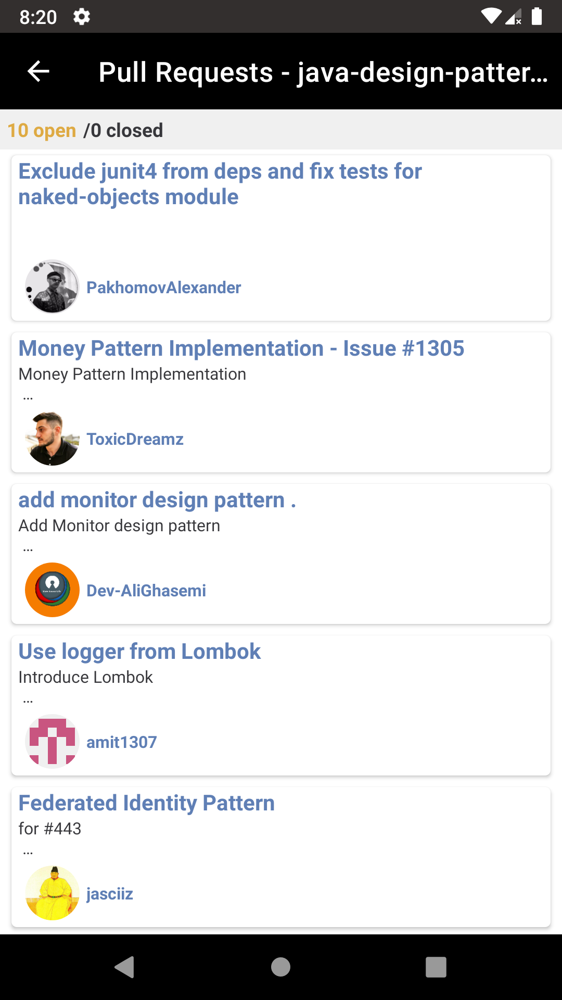

# Android - Arquitetura Modular utilizando a API do GitHub

Exemplo de aplicativo com modularização utilizando:

- LiveData
- RxJava
- Dagger
- Glide
- Retrofit
- ViewBinding
- ConcatAdapter
- MotionLayout (SplashScreen)
- Gradle com Kotlin DSL

O exemplo contém duas dynamic-features. Uma que lista os repositórios Java do GitHub + populares e outra que irá listar os PullRequests do reposiório selecionado.

Como cada feature só possui uma tela, foi criado uma activity por feature. Para uma feature com mais telas, pode ser pensado no uso de fragments + Android Navigation.

| Repositórios  | Pull Request |
| ------------- | ------------- |
|   |   |

## Arquitetura

- Android architecture components
- Pattern Model-View-ViewModel (MVVM)
- Arquitetura Modular permitindo desenvolver features isoladas.

## Módulos

- `:app` -> Módulo principal do App. Possui a Splash que irá direcionar para o primeiro fluxo. Neste caso, a feature "gitRepository"
- `:common:core` -> Módulo core do app que contém as classes "bases", bem como configurações do dagger para o retrofit e ViewModel
- `:common:ui` -> Módulo que possui o "design system" do app. Cores, estilos, componentes de view...
- :`common:features-navigation` -> Módulo responsável por iniciar o fluxo de navegação de uma feature.
- `:features:gitRepository` -> feature que lista os repositórios mais populares de Java
- `:features:pullrequest` -> feature que lista os pull requests de determinado repositório

### Pacotes de features
- `me.ranieripieper.android.github.<feature>.di` -> Pacote para configuração do Dagger
- `me.ranieripieper.android.github.<feature>.data.model` -> Models da Feature
- `me.ranieripieper.android.github.<feature>.data.remote` -> APIs da feature
- `me.ranieripieper.android.github.<feature>.data.repository` -> Repositórios da Feature
- `me.ranieripieper.android.github.<feature>.view` -> Classes de View da Feature (Activity/Fragment/Adapter...)
- `me.ranieripieper.android.github.<feature>.viewModel`-> ViewModel da Feature
- `me.ranieripieper.android.github.<feature>.converter`-> Conversores da Feature - Converte objetos de repository em objetos de View (Presentation`)

## Testes

Foram realizados somentes testes unitários. 

Obs.: Para a feature `features:pullrequest` não foram realizados os testes unitários

## Roadmap

- Implementação de uma feature com duas telas para utilização do Android Navigation;
- Testes Instrumentados;
- Testes unitários em todas as features.